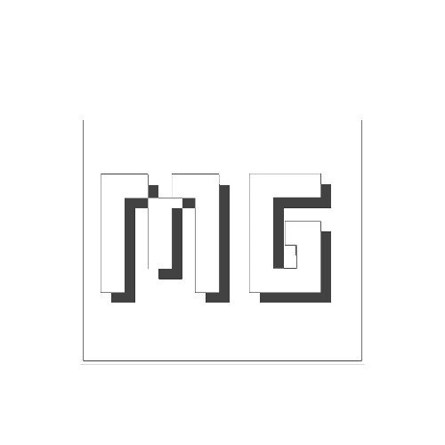

  # MoLaMaZoGAMES
<p align="center">
  
</p>
<p align="center">
  
  
  
  
</p>

MoLaMaZoGAMES es una plataforma web diseñada para la gestión interna de assets digitales en la empresa de videojuegos AAA MoLaMaZoGAMES. La plataforma facilita la colaboración entre desarrolladores, artistas y diseñadores, permitiendo la organización eficiente de contenido digital en diversos formatos, incluyendo modelos 3D, texturas, animaciones, código fuente, música y efectos de sonido.

---

## 👥 Autores

- **Antonio Pascual Mas Martínez**
- **Gabriel Llorca Martínez**
- **Joan Asensio Adsuar**

---

## 🚀 Tecnologías Utilizadas

Este proyecto ha sido desarrollado con la pila **MERN (MongoDB, Express, React, Node.js)**:

- ✅ **Backend:** Construido con **Node.js y Express**, utilizando **MongoDB** como base de datos. El código del backend se encuentra en la carpeta `backend`.
- ✅ **Frontend:** Desarrollado con **React**, ubicado en la carpeta `frontend`.
- ✅ **Documentación:** Toda la documentación del proyecto se encuentra en la carpeta `doc`.

---

## 📦 Instalación

### 🔧 Backend
```bash
# Entrar en la carpeta del backend
cd backend

# Instalar dependencias
npm install

# Iniciar el servidor
npm run dev
```

### 🎨 Frontend
```bash
# Entrar en la carpeta del frontend
cd frontend

# Instalar dependencias
npm install

# Iniciar la aplicación
npm run dev
```


---